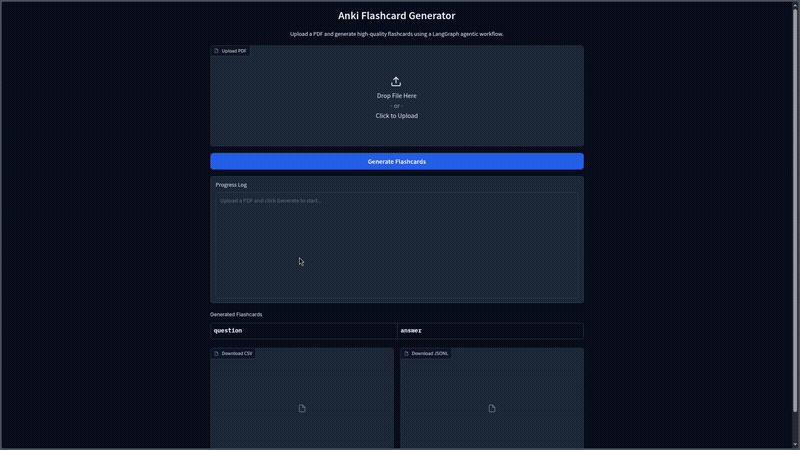
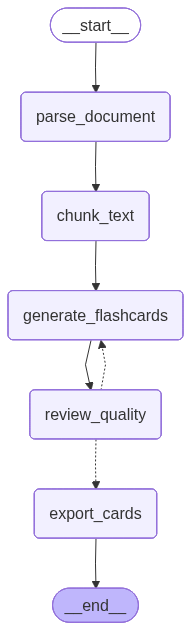

# Anki Flashcard Generator -- LangGraph Agentic Workflow

An intelligent flashcard generator that transforms PDF documents into high-quality Anki-compatible flashcards using a **LangGraph agentic workflow**. The pipeline features a conditional quality gate that autonomously reviews generated flashcards and triggers regeneration when quality standards are not met -- demonstrating agentic decision-making through state-driven control flow.



## Architecture

5-node LangGraph state graph where each node is a pure function that reads from and writes to a shared `FlashcardState` TypedDict. The conditional edge after `review_quality` creates an agentic loop: if the batch fails structural validation, the graph routes back to `generate_flashcards` for a second attempt (capped at 1 retry).



| Node                    | Description                                           | LLM |
| ----------------------- | ----------------------------------------------------- | --- |
| `parse_document`      | Load PDF via PyPDFLoader                              | No  |
| `chunk_text`          | Split into 2000-char overlapping chunks               | No  |
| `generate_flashcards` | Generate Q/A pairs per chunk via LCEL chain           | Yes |
| `review_quality`      | Rule-based dedup, structural validation, quality gate | No  |
| `export_cards`        | Export to CSV (semicolon, UTF-8 BOM) and JSONL        | No  |

**Performance optimizations**:

- Chunks sized at 2000 chars to minimize LLM calls (~12 chunks for an 11-page PDF vs ~51 at 400 chars)
- Quality criteria embedded in the generation prompt (single-pass, no separate LLM review)
- Review node performs fast rule-based validation (dedup, empty field removal, 50% pass-rate threshold)

## Tech Stack

| Component        | Technology                                    |
| ---------------- | --------------------------------------------- |
| Orchestration    | LangGraph (StateGraph with conditional edges) |
| LLM Framework    | LangChain                                     |
| LLM Backend      | Ollama (mistral-large-3:675b-cloud)           |
| Frontend         | Gradio                                        |
| Containerization | Docker / Docker Compose                       |
| Language         | Python 3.12                                   |

## Quickstart

### 1. Install Ollama

Follow the instructions at [ollama.ai](https://ollama.ai/) for your platform, then serve Ollama:

```bash
ollama serve
```

Verify Ollama is working and run at least once a cloud model (no need to pull any model, free tier ollama accounts can use cloud models):

```bash
ollama run mistral-large-3:675b-cloud
```

### 2. Clone the repository

```bash
git clone https://github.com/FranRguezCer/flashcards-anki-gen.git
cd flashcards-anki-gen
```

### 3. Configure environment

```bash
cp .env.template .env
```

Edit `.env` if needed (defaults work for local Ollama):

```
OLLAMA_HOST=http://localhost:11434
OLLAMA_MODEL=mistral-large-3:675b-cloud
OUTPUT_DIR=./output
```

### 4. Run with Docker (recommended)

```bash
docker compose build
docker compose up -d
```

Open [http://localhost:7860](http://localhost:7860), upload a PDF, and click **Generate Flashcards**.

The container uses `network_mode: host` so it reaches Ollama at `localhost:11434` directly. Generated files are persisted to `./output/` on the host.

**Useful commands:**

```bash
# View real-time logs
docker compose logs -f app

# Rebuild after code changes
docker compose up -d --build

# Stop the container
docker compose down
```

### 4b. Run locally (alternative)

```bash
python -m venv .venv
source .venv/bin/activate
pip install -r requirements.txt

python app.py
```

### 4c. Run via CLI

```bash
python main.py --mode cli --file docs/ru_vocabulary.pdf --output ./output
```

### 5. Download your flashcards

After generation completes, download the CSV or JSONL file from the web UI. Import the CSV into Anki using semicolon (`;`) as the field separator.

## Configuration

| Variable         | Default                        | Description                                |
| ---------------- | ------------------------------ | ------------------------------------------ |
| `OLLAMA_HOST`  | `http://localhost:11434`     | Ollama API endpoint                        |
| `OLLAMA_MODEL` | `mistral-large-3:675b-cloud` | Model name for flashcard generation        |
| `OUTPUT_DIR`   | `./output`                   | Directory for exported CSV and JSONL files |

## Project Structure

```
flashcards-anki-gen/
  agent/
    __init__.py                  # Exports build_graph, FlashcardState
    state.py                     # FlashcardState TypedDict with annotated reducer
    prompts.py                   # Quality-aware generation prompt template
    llm.py                       # Shared ChatOllama factory and JSON utilities
    graph.py                     # StateGraph definition and compilation
    nodes/
      __init__.py                # Re-exports all node functions
      parse_document.py          # Node 1: Load PDF via PyPDFLoader
      chunk_text.py              # Node 2: RecursiveCharacterTextSplitter (2000 chars)
      generate_flashcards.py     # Node 3: LCEL chain.batch() parallel generation
      review_quality.py          # Node 4: Rule-based validation and dedup
      export_cards.py            # Node 5: Export to CSV and JSONL
  notebook/
    agent_template.ipynb         # Self-contained development notebook
  output/                        # Generated flashcard files
  docs/                          # Test PDF documents
  assets/                        # Demo gif and graph visualization
  app.py                         # Gradio web interface
  main.py                        # CLI entry point
  requirements.txt               # Python dependencies
  .env.template                  # Environment variable template
  Dockerfile                     # Container image definition
  docker-compose.yml             # Compose configuration (network_mode: host)
  LICENSE                        # MIT License
```

## License

MIT License. See [LICENSE](LICENSE) for details.

## Author

**Francisco Jose Rodriguez Cerezo**
